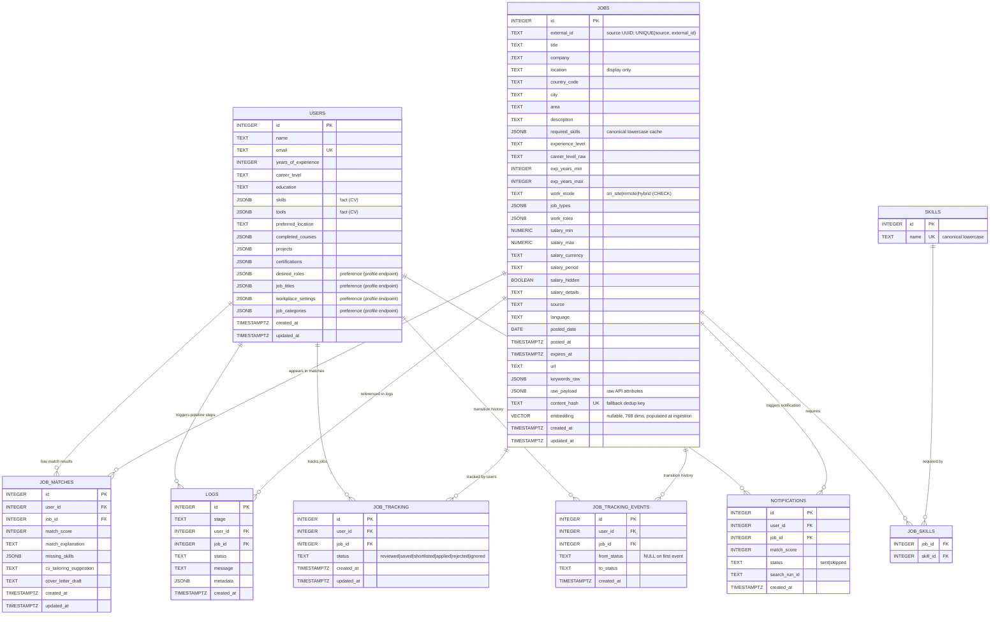

# Entity Relationship Diagram — Career Coach

> Sprint 4 | Data Layer Documentation  
> Last updated: Jul 2026

---

## Database

| Property  | Sprint 1 (old)                    | Current (since Sprint 2)             |
|-----------|-----------------------------------|--------------------------------------|
| Engine    | SQLite 3                          | PostgreSQL 17                        |
| Extension | —                                 | pgvector (vector similarity)         |
| ORM       | raw sqlite3 + dataclasses         | SQLModel + SQLAlchemy                |
| Access    | sync sqlite3                      | async (psycopg3 async + AsyncSession)|
| Datetime  | TEXT (ISO 8601 string)            | TIMESTAMPTZ / DATE (native)          |
| Lists     | TEXT (JSON string)                | JSONB (native, queryable)            |
| Vectors   | not supported                     | Vector(768) on jobs.embedding        |
| Docker    | not required                      | docker-compose.yml (required)        |

---

## Overview

The Career Coach database is built around the **4 core domain tables** from the
project brief (`users`, `jobs`, `job_matches`, `logs`), plus the normalized
**`skills` / `job_skills`** tables added for skill analytics (and the
`job_tracking` tables from the tracking feature). The design follows these
principles:

- **List fields** (user skills, courses, etc.) are stored natively as **JSONB**
  columns — queryable with PostgreSQL's JSON operators and indexable via GIN,
  with no manual serialization. **Job skills are the exception**: they are
  canonicalized and normalized into `skills` / `job_skills` for clean trend
  aggregation, with `jobs.required_skills` kept as a JSONB cache (see Design
  Decision 2).
- **All database access is async** — an async SQLAlchemy engine over the
  psycopg3 async driver, with `AsyncSession` for every query.
- **Foreign keys** are enforced natively by PostgreSQL.
- **Deduplication** of job postings prefers the source's stable
  `(source, external_id)`, falling back to a SHA-256 `content_hash`.
- **Audit timestamps** (`created_at`, `updated_at`) are PostgreSQL `TIMESTAMPTZ`
  columns defaulting to `_utcnow()` — timezone-aware datetime objects.

---

## Entity Relationship Diagram



---

## Table Descriptions

### `users`
Stores the structured career profile extracted from a user's uploaded CV.
One row per user.

| Column | Type | Notes |
|--------|------|-------|
| `id` | `INTEGER PK` | Auto-increment primary key |
| `name` | `TEXT NOT NULL` | Full name from CV |
| `email` | `TEXT UNIQUE` | Optional; unique if provided |
| `years_of_experience` | `INTEGER` | Default 0 |
| `career_level` | `TEXT` | CHECK: `junior` / `mid` / `senior` |
| `education` | `TEXT` | e.g. "BSc CS, Cairo University" |
| `skills` | `JSONB` | **Fact (CV-parsed).** JSON array: `["Python", "LangChain"]` |
| `tools` | `JSONB` | **Fact (CV-parsed).** Tools/technologies the user knows |
| `preferred_location` | `TEXT` | e.g. "Cairo", "Remote", "UAE" |
| `completed_courses` | `JSONB` | JSON array — Sprints.ai differentiator |
| `projects` | `JSONB` | JSON array — Sprints.ai differentiator |
| `certifications` | `JSONB` | JSON array |
| `desired_roles` | `JSONB` | **Preference — user-set via `PATCH /users/{id}/preferences`, NOT CV-parsed.** Steers recommendations |
| `job_titles` | `JSONB` | **Preference (profile endpoint).** Target job titles; steers recommendations |
| `workplace_settings` | `JSONB` | **Preference (profile endpoint).** Subset of `remote`/`hybrid`/`on_site`; filters recommendations by `jobs.work_mode` |
| `job_categories` | `JSONB` | **Preference (profile endpoint).** Steers recommendations |
| `created_at` | `TIMESTAMPTZ` | UTC timezone-aware, set on insert |
| `updated_at` | `TIMESTAMPTZ` | UTC timezone-aware, updated on change |

**Why JSONB for list columns?**  
A normalised design would create separate `user_skills` and `user_courses` tables.
For this 4-week prototype, that adds 4+ joins to every query with no benefit.
JSONB stores each list as a single native column the ORM reads/writes as a
Python list, and — unlike the old JSON-in-`TEXT` approach — it can be queried
in SQL (`@>`, `?`, `jsonb_array_elements`) and indexed with GIN when a skill
filter needs to run in the database instead of in Python.

---

### `jobs`
Normalized job postings collected from Wuzzuf, Bayt, and other sources.
One row per unique job posting. The Wuzzuf pipeline captures the source's
structured fields directly (see [`wuzzuf_parsing`](../app/services/job_sources/wuzzuf_parsing.py)).

| Column | Type | Notes |
|--------|------|-------|
| `id` | `INTEGER PK` | Auto-increment primary key |
| `external_id` | `TEXT` | Source's stable id (Wuzzuf UUID). `UNIQUE(source, external_id)` — primary dedup key |
| `title` | `TEXT NOT NULL` | English-first (prefers the source's EN translation) |
| `company` | `TEXT NOT NULL` | `"Confidential"` when the source hides it |
| `location` | `TEXT` | Display-only `"City, Country"` string |
| `country_code` | `TEXT` | `EG` / `SA` / `QA` / `AE` |
| `city` | `TEXT` | e.g. "Cairo" |
| `area` | `TEXT` | e.g. "Nasr City" |
| `description` | `TEXT NOT NULL` | Full description + requirements, HTML stripped |
| `required_skills` | `JSONB` | Canonical **lowercase** cache (normalized source of truth is `skills`/`job_skills`) |
| `experience_level` | `TEXT` | CHECK: `junior` / `mid` / `senior` |
| `career_level_raw` | `TEXT` | Raw Wuzzuf level: `Entry Level` / `Experienced` / `Manager` / ... |
| `exp_years_min` / `exp_years_max` | `INTEGER` | Required years range (either may be NULL) |
| `work_mode` | `TEXT` | CHECK: `on_site` / `remote` / `hybrid` (or NULL) |
| `job_types` | `JSONB` | Multi-valued, e.g. `["full_time"]` |
| `work_roles` | `JSONB` | Multi-valued category, e.g. `["IT/Software Development"]` |
| `salary_min` / `salary_max` | `NUMERIC(12,2)` | Raw values; may be equal (single figure) |
| `salary_currency` | `TEXT` | `EGP` / `USD` / `SAR` / ... — **never inferred from country** |
| `salary_period` | `TEXT` | `Per Month` / `Per Hour` |
| `salary_hidden` | `BOOLEAN` | Source hid the figure (the real "is salary visible" flag) |
| `salary_details` | `TEXT` | Free-text extras ("2.5 Months Incentive") |
| `source` | `TEXT` | CHECK: `wuzzuf` / `bayt` / `linkedin` / `other` |
| `language` | `TEXT` | Detected primary language of the posting |
| `posted_date` | `DATE` | Native PostgreSQL date |
| `posted_at` / `expires_at` | `TIMESTAMPTZ` | Full posting/expiry timestamps |
| `url` | `TEXT` | Original listing URL |
| `keywords_raw` | `JSONB` | Original keyword names, pre-canonicalization |
| `raw_payload` | `JSONB` | Raw source attributes — re-parse new fields without re-scraping |
| `content_hash` | `TEXT UNIQUE` | Fallback dedup key for sources lacking `external_id` |
| `embedding` | `VECTOR` | nullable, 768 dims (BAAI/bge-base-en-v1.5), populated at ingestion + backfill |
| `created_at` / `updated_at` | `TIMESTAMPTZ` | UTC timezone-aware |

**Deduplication strategy:**  
Dedup prefers **`(source, external_id)`** — the source's stable per-posting id,
immune to title/company edits. For sources without one (fixtures), it falls back
to the **`content_hash`** SHA-256 of `title | company | posted_date` (hidden
companies use the URL instead of the company). Both tiers live in
`JobPosting`/`job_deduplication_service`; `content_hash` is computed in
`JobPosting.compute_content_hash()`.

---

### `skills` and `job_skills`
Canonical skill dictionary and the many-to-many link to jobs.

- **`skills`** — `id PK`, `name TEXT UNIQUE` (canonical lowercase token). One row
  per distinct skill, get-or-created at ingestion.
- **`job_skills`** — composite PK `(job_id, skill_id)`, both FKs `ON DELETE
  CASCADE`. Links a job to its canonical skills.

Skills are canonicalized at ingestion (lowercase, synonym-mapped via
`data/skill_aliases.json`, with Arabic requirement *sentences* dropped) by
[`app/services/skills/canonicalizer.py`](../app/services/skills/canonicalizer.py)
and linked by `app/services/skills/repository.py`. `jobs.required_skills` keeps a
denormalized lowercase copy for the matching engine; `skills`/`job_skills` is the
normalized source of truth that powers the skill-trend `GROUP BY`.

---

### `job_matches`
AI-generated match results between a user and a job.
One row per `(user_id, job_id)` pair — enforced by a `UNIQUE` constraint.
Re-running the matching engine uses upsert logic to overwrite stale results.

| Column | Type | Notes |
|--------|------|-------|
| `id` | `INTEGER PK` | Auto-increment primary key |
| `user_id` | `INTEGER FK` | References `users.id` — CASCADE on delete |
| `job_id` | `INTEGER FK` | References `jobs.id` — CASCADE on delete |
| `match_score` | `INTEGER` | 0–100, enforced by CHECK constraint |
| `match_explanation` | `TEXT` | "You match because…" — LLM-generated |
| `missing_skills` | `JSONB` | JSON array of skill gaps |
| `cv_tailoring_suggestion` | `TEXT` | Role-specific CV advice |
| `cover_letter_draft` | `TEXT` | NULL until Sprint 4 |
| `created_at` | `TIMESTAMPTZ` | UTC timezone-aware |
| `updated_at` | `TIMESTAMPTZ` | UTC timezone-aware |

---

### `logs`
Append-only audit log for every pipeline operation.
Rows are **never updated** after insert — this is an immutable event log.

| Column | Type | Notes |
|--------|------|-------|
| `id` | `INTEGER PK` | Auto-increment primary key |
| `stage` | `TEXT` | CHECK: one of 6 allowed stages (see below) |
| `user_id` | `INTEGER FK` | Optional — `SET NULL` on user delete |
| `job_id` | `INTEGER FK` | Optional — `SET NULL` on job delete |
| `status` | `TEXT` | CHECK: `started` / `success` / `failure` |
| `message` | `TEXT` | Human-readable description |
| `metadata` | `JSONB` | JSON blob: tokens used, latency, model name, etc. |
| `created_at` | `TIMESTAMPTZ` | UTC timezone-aware — immutable after insert |

**Allowed stages:**

| Stage | When it fires |
|-------|--------------|
| `cv_parse` | PDF text extraction begins/ends |
| `profile_extract` | LLM CV → UserProfile JSON |
| `job_ingest` | Raw job data → normalized JobPosting |
| `matching` | Profile × jobs → JobMatch scores |
| `cover_letter` | Cover letter generation (Sprint 4) |
| `error` | Any unhandled failure in the pipeline |

**Why store `metadata` as JSONB?**  
Each stage emits different operational data: `cv_parse` logs token counts,
`matching` logs query latency, `cover_letter` logs model costs.
A flexible JSONB blob avoids schema migrations every time we add a new metric,
while still allowing the values to be queried in SQL when needed.

---

### `job_tracking` and `job_tracking_events`
A user's personal job pipeline (the job-tracking feature). Defined in
[`app/models/job_tracking.py`](../app/models/job_tracking.py), alongside the rest
of `app/models/` — see the note below.

**`job_tracking`** — the *current* state of each `(user_id, job_id)` pair. Exactly
one row per pair (`UNIQUE(user_id, job_id)`), overwritten in place on each
transition. Same single-row-per-pair pattern as `job_matches`.

| Column | Type | Notes |
|--------|------|-------|
| `id` | `INTEGER PK` | Auto-increment primary key |
| `user_id` | `INTEGER FK` | References `users.id` — CASCADE on delete |
| `job_id` | `INTEGER FK` | References `jobs.id` — CASCADE on delete |
| `status` | `TEXT` | `TrackingStatus` enum: `reviewed` / `saved` / `shortlisted` / `applied` / `rejected` / `ignored` (default `reviewed`) |
| `created_at` / `updated_at` | `TIMESTAMPTZ` | UTC timezone-aware |

**`job_tracking_events`** — *append-only* audit log: one row per real status
transition. Never updated or deleted (same immutable-event intent as `logs`).

| Column | Type | Notes |
|--------|------|-------|
| `id` | `INTEGER PK` | Auto-increment primary key |
| `user_id` | `INTEGER FK` | References `users.id` — CASCADE on delete |
| `job_id` | `INTEGER FK` | References `jobs.id` — CASCADE on delete |
| `from_status` | `TEXT` | The state left — `NULL` on the first transition |
| `to_status` | `TEXT` | The state entered |
| `created_at` | `TIMESTAMPTZ` | Set once on insert — immutable |

> **Note on module location.** All SQLModel tables and Pydantic domain schemas
> now live under `app/models/`: shared helpers/constants in `app/models/helpers.py`,
> the core jobs/users domain in `app/models/jobs.py`, and job tracking in
> `app/models/job_tracking.py`. `app/models/__init__.py` re-exports everything,
> and all register on the same `SQLModel.metadata`, so Alembic and the schema
> treat them identically. See the feature doc
> [`docs/features/job-tracking-and-trends.md`](features/job-tracking-and-trends.md).

---

### `notifications`
Records notifications for users regarding matched jobs.
Exactly one row per `(user_id, job_id)` pair (`UNIQUE(user_id, job_id)`) to prevent duplicate notifications across multiple search runs.

| Column | Type | Notes |
|--------|------|-------|
| `id` | `INTEGER PK` | Auto-increment primary key |
| `user_id` | `INTEGER FK` | References `users.id` — CASCADE on delete |
| `job_id` | `INTEGER FK` | References `jobs.id` — CASCADE on delete |
| `match_score` | `INTEGER` | 0–100, the score that triggered this notification |
| `status` | `TEXT` | `NotificationStatus` enum: `sent` / `skipped` |
| `search_run_id` | `TEXT` | Links back to the `logs.metadata` for the run |
| `created_at` | `TIMESTAMPTZ` | UTC timezone-aware |

---

## Relationships

| Relationship | Cardinality | FK Rule |
|---|---|---|
| `users` → `job_matches` | One-to-Many | `ON DELETE CASCADE` |
| `jobs` → `job_matches` | One-to-Many | `ON DELETE CASCADE` |
| `users` → `logs` | One-to-Many | `ON DELETE SET NULL` |
| `jobs` → `logs` | One-to-Many | `ON DELETE SET NULL` |
| `jobs` → `job_skills` | One-to-Many | `ON DELETE CASCADE` |
| `skills` → `job_skills` | One-to-Many | `ON DELETE CASCADE` |
| `users` → `job_tracking` | One-to-Many | `ON DELETE CASCADE` |
| `jobs` → `job_tracking` | One-to-Many | `ON DELETE CASCADE` |
| `users` → `job_tracking_events` | One-to-Many | `ON DELETE CASCADE` |
| `jobs` → `job_tracking_events` | One-to-Many | `ON DELETE CASCADE` |
| `users` → `notifications` | One-to-Many | `ON DELETE CASCADE` |
| `jobs` → `notifications` | One-to-Many | `ON DELETE CASCADE` |

**Cascade vs. Set Null:**  
- **job_matches** cascade-delete because a match without a user or job is meaningless.
- **logs** use `SET NULL` because the audit trail should survive even if
  the underlying user or job is deleted. The log still tells you *what happened*
  even without the linked record.

---

## Indexes

| Index | Table | Columns | Purpose |
|---|---|---|---|
| `idx_users_email` | `users` | `email` (partial, WHERE NOT NULL) | Email lookup |
| `idx_jobs_source` | `jobs` | `source` | Filter by Wuzzuf / Bayt |
| `idx_jobs_level` | `jobs` | `experience_level` | Filter by junior/mid/senior |
| `idx_jobs_posted` | `jobs` | `posted_date DESC` | Chronological job feed |
| `idx_jobs_required_skills_gin` | `jobs` | `required_skills` (GIN `jsonb_path_ops`) | Keyword pre-filter fast path (`@>` containment) |
| `idx_jobs_embedding_hnsw` | `jobs` | `embedding` (HNSW `vector_cosine_ops`, m=16, ef_construction=64) | Approximate nearest-neighbour vector search |
| `uq_jobs_source_external_id` | `jobs` | `(source, external_id)` UNIQUE | Primary dedup key |
| `ix_jobs_external_id` | `jobs` | `external_id` | Lookup by source id |
| `ix_jobs_country_code` | `jobs` | `country_code` | Filter / group by MENA country |
| `ix_jobs_work_mode` | `jobs` | `work_mode` | Filter remote / hybrid / on-site |
| `ix_skills_name` | `skills` | `name` UNIQUE | Canonical skill get-or-create |
| `job_skills` PK | `job_skills` | `(job_id, skill_id)` | Skill ↔ job join |
| `idx_matches_user_score` | `job_matches` | `(user_id, match_score DESC)` | Fetch top-N matches for a user |
| `idx_logs_stage` | `logs` | `stage` | Debug: view all CV parse logs |
| `idx_logs_user` | `logs` | `user_id` | View all logs for a user |
| `idx_logs_status` | `logs` | `status` | Filter for failures |
| `uq_job_tracking_user_job` | `job_tracking` | `(user_id, job_id)` UNIQUE | One pipeline row per pair |
| `ix_job_tracking_user_id` | `job_tracking` | `user_id` | A user's tracked jobs |
| `ix_job_tracking_job_id` | `job_tracking` | `job_id` | Who tracks a job |
| `ix_job_tracking_events_user_id` | `job_tracking_events` | `user_id` | A user's transition history |
| `ix_job_tracking_events_job_id` | `job_tracking_events` | `job_id` | A job's transition history |
| `uq_notifications_user_job` | `notifications` | `(user_id, job_id)` UNIQUE | Prevent duplicate notifications |
| `ix_notifications_user_id` | `notifications` | `user_id` | Find user's notifications |
| `ix_notifications_job_id` | `notifications` | `job_id` | Find job's notifications |
| `ix_notifications_search_run_id` | `notifications` | `search_run_id` | Query run notifications |

---

## Design Decisions

This section documents the key trade-offs made during the Sprint 2 data-layer migration.

### 1. PostgreSQL 17 as the primary database engine

**Decision:** Migrate from SQLite to PostgreSQL 17 with the pgvector extension.

**Rationale:**

| Factor | SQLite (Sprint 1) | PostgreSQL 17 (Sprint 2) |
|--------|--------|------------|
| Setup complexity | Zero — ships with Python | Requires Docker container |
| Test isolation | `:memory:` per test — no cleanup needed | Requires drop/create per test |
| Dev onboarding | `open_connection()` is a one-liner | Connection strings, docker-compose |
| Concurrency | Single-writer — sufficient for prototype | Multi-writer — needed for prod scale |
| Native datetimes | No — stored as TEXT strings | Yes — TIMESTAMPTZ and DATE native types |
| Vector search | Not supported | pgvector extension, Vector(768) |

**When to scale further:** Connection pooling via PgBouncer when concurrent user
load exceeds PostgreSQL's default connection limit.

---

### 2. JSONB columns instead of junction tables

**Decision:** List fields (`skills`, `required_skills`, `completed_courses`, etc.)
are stored as native `JSONB` columns, not normalised into separate tables.

**Rejected alternatives:**
- Junction tables — `user_skills(user_id, skill)` and `job_skills(job_id, skill)`
  joined on every read.
- JSON-in-`TEXT` (the earlier approach) — strings that had to be manually
  serialized/deserialized in application code and could not be queried in SQL.

**Rationale:**  
- The matching engine consumes the full list in one shot — no partial lookups.
- JSONB gives the queryability of a real column (operators `@>`, `?`,
  `jsonb_array_elements`, plus optional GIN indexes) without the 16 extra
  tables/joins a fully normalised design would add at prototype scale.
- The ORM exposes each column as a plain Python `list`/`dict`, so there is no
  `json.dumps`/`json.loads` plumbing — fewer places for the serialized shape to
  drift from the schema.

**Skills — the exception (Sprint 3–4):** `jobs` skills are now **also** normalized
into `skills` + `job_skills`. JSONB was the right call for the user-profile lists
and `logs.metadata` (consumed whole, never aggregated), but skills became the
core of the market-trend analytics — and JSONB couldn't give clean
`GROUP BY skill` (no canonicalization, `node.js`/`NodeJS` double-counted, Arabic
sentences mixed in). So skills are canonicalized once at ingestion and stored
normalized, with `jobs.required_skills` kept as a denormalized lowercase cache
for the matching engine's one-shot read. The other JSONB list columns are
unchanged.

**Sprint 4 note:** Semantic search now complements skill filtering — the
`embedding` column (Vector(768) via pgvector, HNSW-indexed) powers vector search,
combined with the GIN keyword pre-filter for hybrid retrieval. (The column
existed earlier as a Vector(1536) placeholder; it was resized to 768 and wired up
for real in Sprint 4 — see Migration Notes.)

---

### 3. `external_id` (with `content_hash` fallback) for job deduplication

**Decision:** Deduplicate primarily on **`(source, external_id)`** — the source's
stable per-posting id (the Wuzzuf UUID) — falling back to a SHA-256
`content_hash` of `title.lower() | company.lower() | str(posted_date)` for
sources that lack a stable id.

**Why external_id first:** it is immune to title/company edits and never
collides across distinct postings, unlike the hash (two different jobs sharing a
title+company+date would collide). `content_hash` remains the dedup key for
fixtures and any future source without a stable id.

**Rejected alternatives:**
- `UNIQUE(title, company, posted_date)` — functionally equivalent to the hash but
  stores three separate TEXT columns in the index; the hash gives a fixed index
  key and case-insensitivity.
- URL uniqueness — URLs change (redirect chains, query params) so they are not
  a reliable deduplication key.

**Re-run strategy:** The pipeline catches `IntegrityError` per duplicate and rolls
back that row individually, continuing with the next record.

---

### 4. SQLModel + SQLAlchemy for ORM

**Decision:** Use SQLModel (which wraps SQLAlchemy + Pydantic) for table definitions
and session management instead of raw psycopg2 or aiohttp.

**Rationale:**
- Single source of truth: SQLModel table classes serve as both ORM models and
  Pydantic-compatible schemas.
- Async throughout: an async SQLAlchemy engine over the psycopg3 async driver,
  with `AsyncSession` injected into every FastAPI route and service. The same
  `postgresql+psycopg` URL drives both sync (tests/DDL) and async access, so no
  separate async driver (asyncpg) is needed.
- Schema is owned by **Alembic migrations** (`alembic upgrade head`), not by
  `schema.sql` DDL. The app does not create tables at startup.

---

### 5. Real PostgreSQL database for all tests

**Decision:** All pytest tests use a real PostgreSQL test database
(`career_coach_test`) instead of SQLite `:memory:`.

**Rationale:**

| Factor | PostgreSQL test DB | SQLite :memory: |
|--------|-----------|---------------------|
| Native type parity | TIMESTAMPTZ / DATE — exact prod behavior | TEXT string workarounds |
| pgvector support | Yes — extension available | No |
| Test isolation | Drop/create all tables per test | Perfect — discard on close |
| CI portability | Requires Docker service | Works anywhere Python runs |

**Trade-off:** Tests require `docker compose up -d` before running. The `session`
fixture in `conftest.py` handles create/drop per test for isolation.

---

## Files Reference

| File | Purpose |
|---|---|
| [`app/models/jobs.py`](../app/models/jobs.py) | Core SQLModel tables (`users`, `jobs`, `skills`, `job_skills`, `job_matches`, `logs`) + Pydantic domain schemas |
| [`app/models/helpers.py`](../app/models/helpers.py) | Shared helpers/constants (`_utcnow`, `_normalize_text`, `WORK_MODES`, `HIDDEN_COMPANY`) |
| [`app/models/job_tracking.py`](../app/models/job_tracking.py) | `job_tracking` + `job_tracking_events` tables and the `TrackingStatus` enum |
| [`app/core/embeddings.py`](../app/core/embeddings.py) | Embedding model/dim constants + canonical candidate/job text builders |
| [`app/services/match_service.py`](../app/services/match_service.py) | Persisted (user, job) match analysis → `job_matches` |
| [`app/db/connection.py`](../app/db/connection.py) | Async SQLAlchemy engine + AsyncSession factory (psycopg3 async driver) |
| [`app/services/job_sources/wuzzuf_parsing.py`](../app/services/job_sources/wuzzuf_parsing.py) | Pure Wuzzuf JSON → JobPosting mapping (extractors) |
| [`app/services/skills/`](../app/services/skills/) | Skill canonicalizer + alias map + link repository |
| [`data/skill_aliases.json`](../data/skill_aliases.json) | Skill synonym → canonical alias seed map |
| [`scripts/generate_sample_jobs.py`](../scripts/generate_sample_jobs.py) | Regenerate `sample_jobs.json` from live Wuzzuf data |
| [`app/core/config/settings.py`](../app/core/config/settings.py) | Pydantic Settings — `DATABASE_URL` and related |
| [`alembic/versions/`](../alembic/versions/) | Alembic migrations — schema is owned here |
| [`data/sample_jobs.json`](../data/sample_jobs.json) | Real Wuzzuf job postings (processed JobPosting shape) for dev/testing and demo fallback |
| [`tests/conftest.py`](../tests/conftest.py) | Shared session fixture for PostgreSQL tests |
| [`tests/test_schema.py`](../tests/test_schema.py) | Categories 1–8: schema, CRUD, Pydantic, cascade |
| [`tests/test_sample_dataset.py`](../tests/test_sample_dataset.py) | Category 8: end-to-end sample dataset tests |
| [`docker-compose.yml`](../docker-compose.yml) | PostgreSQL 17 + pgvector service definition |

---

## Running the Test Suite

```bash
# Start PostgreSQL (required)
docker compose up -d

# Run all tests
uv run pytest tests/ -v

# Run only the schema/CRUD tests
uv run pytest tests/test_schema.py -v

# Run only the sample-dataset integration tests
uv run pytest tests/test_sample_dataset.py -v

# Run with coverage
uv run pytest tests/ --cov=app/db --cov-report=term-missing

# Configure the test database via the TEST_POSTGRES_* env vars (TestSettings
# composes the connection URL from them — see app/core/config/test_settings.py):
#   TEST_POSTGRES_HOST, TEST_POSTGRES_PORT, TEST_POSTGRES_DB,
#   TEST_POSTGRES_USER, TEST_POSTGRES_PASSWORD
uv run pytest tests/ -v
```

All tests require a running PostgreSQL instance. Each test function gets a
completely fresh schema (tables created before, dropped after) for perfect
isolation.

---

## Migration Notes

### Sprint 3–4 — Wuzzuf enrichment + canonical skills (`4f5815568044`)

The jobs-table expansion and the normalized skills tables were built out across
Sprints 3 and 4. Migration `4f5815568044` (down-revision `b9f20459bfce`) expands
`jobs` and adds the normalized skills tables:

- **`jobs` gains** `external_id` (+ `UNIQUE(source, external_id)`), split location
  (`country_code` / `city` / `area`), `work_mode` (CHECK), `job_types`,
  `work_roles`, `career_level_raw`, `exp_years_min/max`, the salary block
  (`salary_min/max/currency/period/hidden/details`), `language`, `posted_at`,
  `expires_at`, `keywords_raw`, and `raw_payload`. New indexes on `external_id`,
  `country_code`, `work_mode`.
- **New tables** `skills` (canonical lowercase dictionary) and `job_skills`
  (composite-PK link, FKs `ON DELETE CASCADE`).
- **Ingestion** now captures Wuzzuf's structured fields directly
  (`wuzzuf_parsing`), scopes search to the MENA countries, canonicalizes skills
  (`app/services/skills/`), and dedups on `external_id`. The market-trend service
  dropped its `ILIKE`/`CASE`/length-filter heuristics for plain `GROUP BY`/joins.
- **How it was applied:** the dev DB is disposable — run
  `uv run python -m scripts.reset_db`, which drops the schema and replays the full
  migration chain on an empty database (no backfill needed).

### Sprint 4 — real embeddings + hybrid search

- **`jobs.embedding` resized** from the original `Vector(1536)` placeholder to
  **`Vector(768)`** (migration `e2f3a4b5c6d7`) for `BAAI/bge-base-en-v1.5`,
  populated at ingestion and backfilled for existing rows.
- **Hybrid-retrieval indexes** (migration `f3a4b5c6d7e8`): a GIN
  `jsonb_path_ops` index on `required_skills` for the keyword pre-filter, plus an
  HNSW `vector_cosine_ops` index on `embedding` for approximate nearest-neighbour
  vector search.
- **Shadow schema dropped** (migration `d1e2f3a4b5c6`): the disconnected
  `role_benchmark` / `readiness_score` tables were removed and real AI results are
  now written to `job_matches`. User preferences moved to a
  `PATCH /users/{id}/preferences` endpoint (the CV parser no longer fills them).

### Async + JSONB conversion

The data layer moved to fully async access and native JSONB storage:

- **Async access:** `app/db/connection.py` now builds an async engine via
  `create_async_engine` and yields `AsyncSession`. Services
  (`deduplicate`, `collect_from_source`, `collect_from_sources`), the
  `BaseJobSource.fetch` contract, and the `/api/v1/jobs` routes are all `async`.
  On Windows the selector event-loop policy is set at import time because
  psycopg3's async driver cannot run on the default ProactorEventLoop.
- **JSONB:** all list columns (`users.skills`, `users.desired_roles`,
  `users.completed_courses`, `users.projects`, `users.certifications`,
  `jobs.required_skills`, `job_matches.missing_skills`)
  and `logs.metadata` changed from JSON-in-`TEXT` to native `JSONB`. The
  `_dumps`/`_loads` helpers and the `get_*()` accessor methods were removed —
  the ORM now reads/writes native Python lists and dicts directly.
- **How it was applied:** the schema is managed by **Alembic** — the initial
  schema lives in `alembic/versions/` and is applied with `alembic upgrade head`.
  The development/test database is disposable, so early iterations could be
  rolled out by dropping and recreating; Alembic now provides versioned,
  repeatable migrations as the schema evolves against data that must be preserved.

### Sprint 2 — SQLite → PostgreSQL + pgvector

The entire database layer was migrated from SQLite to PostgreSQL 17
with the pgvector extension. The `embedding` column was added here as a
`Vector(1536)` placeholder; semantic search was only wired up for real — and the
column resized to `Vector(768)` — in Sprint 4 (see above).

**Schema changes:**
- `created_at` and `updated_at` changed from TEXT to TIMESTAMPTZ
- `posted_date` changed from TEXT to DATE
- `matches` renamed to `job_matches` per project brief contract
- `pipeline_logs` renamed to `logs` per project brief contract
- `jobs` table gains `embedding` column as a `Vector(1536)` placeholder for
  pgvector (resized to **Vector(768)** and actually populated in Sprint 4 — see
  the Sprint 4 migration note above)

**Code changes:**
- `app/db/connection.py` replaced sqlite3 with SQLModel + asyncpg engine
- `app/db/models.py` replaced dataclasses with SQLModel table classes
- `schema.sql` is no longer used — the schema is owned by Alembic migrations
  (`alembic upgrade head`)
- `_now_utc()` string helper removed — replaced with `_utcnow()`
  returning a proper datetime object
- `JobPosting.to_job_row()` renamed to `to_job_table()`, returning `JobTable`
- `UserProfile.to_user_row()` renamed to `to_user_table()`, returning `UserTable`
